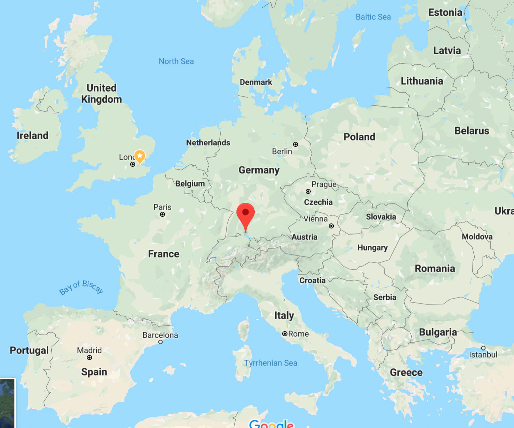

# Overview

 Provided a list of city names:
 
 ```javascript
 var destinations = ["Innsbruck, Austria", ... , "Munich, Germany"]
 ```
 
Calculate the best headquarters for making separate road trips to these POI:

```javascript
Road Trip Headquarters: [47.703718843999994,9.233463372]
```



# Integrations

Google Maps Geocoding REST API - Converts city names to lat/long coordinates

# Thank you

Randy Olson - https://github.com/rhiever/optimal-roadtrip-usa
